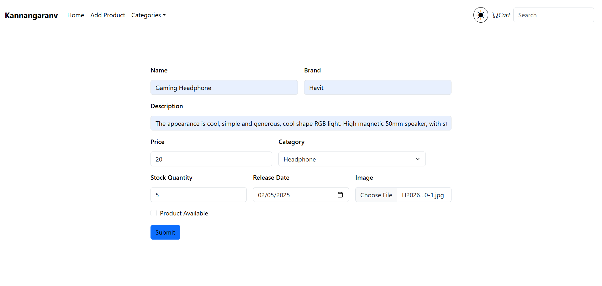
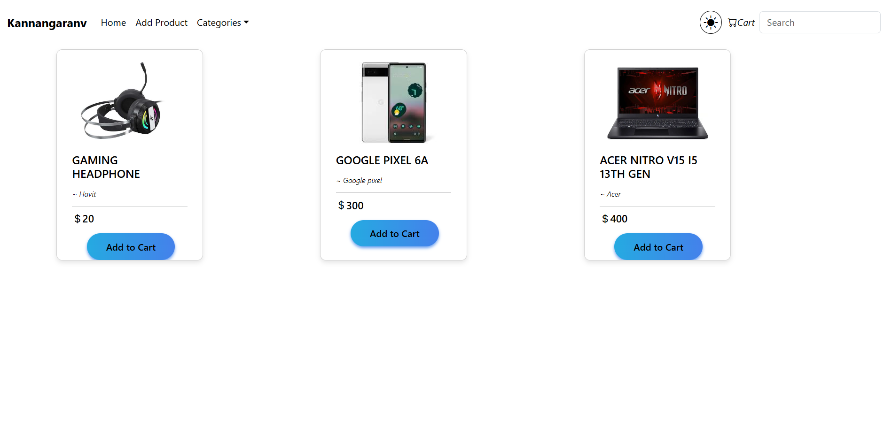
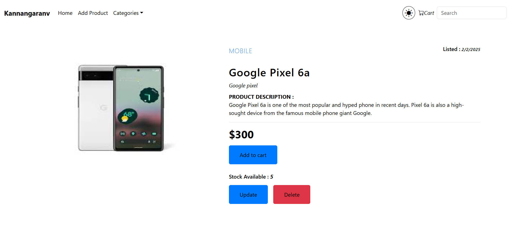
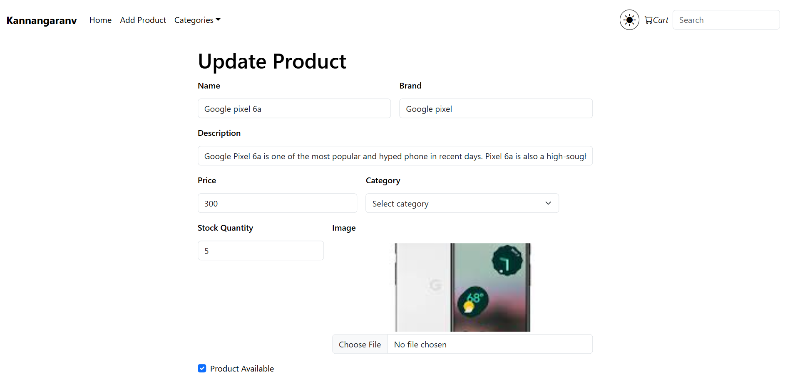
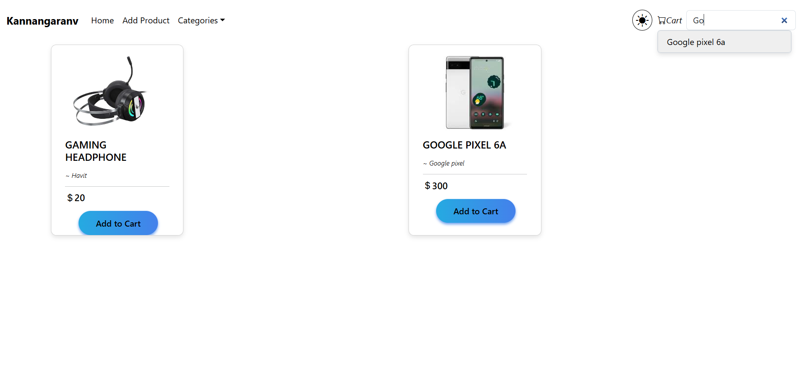
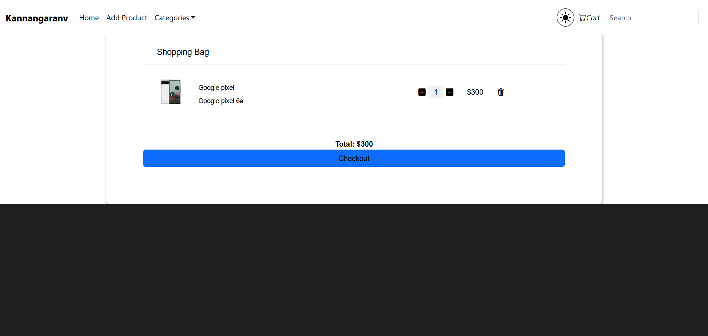

# E-Commerce Web Application

## Overview
This project is a full-stack e-commerce web application that enables users to view, add, update, delete, and search products seamlessly.

## Features
- **Product Management:** Add, update, delete, and search for products.
- **Cart Functionality:** Add products to the cart, adjust quantities, and proceed to checkout.
- **Search Bar:** Quickly find products using the search functionality.
- **Dark/Light Mode Toggle:** Switch between light and dark themes for better accessibility.

## Tech Stack
- **Frontend:** React
- **Backend:** Java Spring Boot
- **Database:** H2 Database (In-memory database for efficient data management)

## Screenshots
1. **Add Product Interface:**
   

2. **Product Listing Page:**
   

3. **Product Details View:**
   

4. **Update Product Page:**
   

5. **Search Functionality:**
   

6. **Shopping Cart:**
   

7. **Dark Mode Interface:**
   

## Installation
1. **Clone the repository:**
   ```bash
   git clone https://github.com/your-repo/ecom_web_application.git
   ```

2. **Navigate to the project directory:**
   ```bash
   cd ecom_web_application_using_java_spring_boot
   ```

3. **Frontend Setup:**
   ```bash
   cd frontend
   npm install
   npm run dev
   ```

4. **Backend Setup:**
   - Import the backend project into an IDE like IntelliJ .
   - Run the Spring Boot application.

## Usage
- Visit the homepage to browse products.
- Use the **Add Product** option to include new items.
- Click on a product card to view details, update, or delete.
- Utilize the search bar for quick product searches.
- Add items to the cart and proceed to checkout.


> Developed with ❤️ using Java Spring Boot and React.
